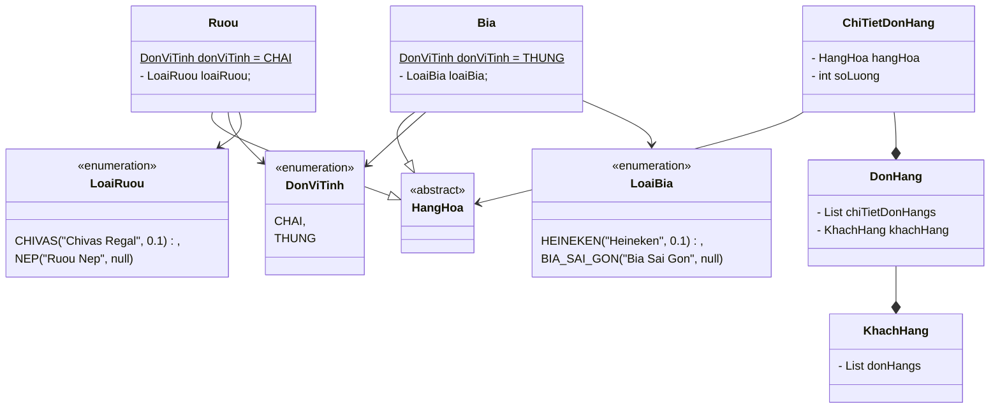
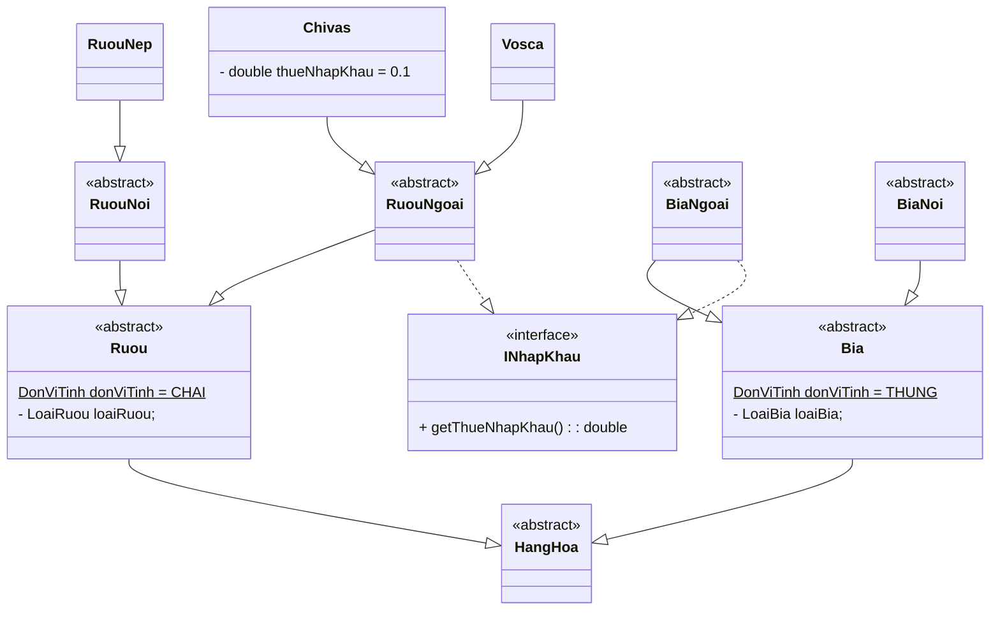

```mermaid
classDiagram
    class HangHoa {
        <<abstract>>
        
    }
    
    class Ruou {
        DonViTinh donViTinh = CHAI$
        - LoaiRuou loaiRuou;
    }
    
    class Bia {
        DonViTinh donViTinh = THUNG$
        - LoaiBia loaiBia;
    }
    
    class DonViTinh {
        <<enumeration>>
        CHAI, 
        THUNG
    }
    
    class LoaiRuou {
        <<enumeration>>
        CHIVAS("Chivas Regal", 0.1),
        NEP("Ruou Nep", null)
    }
    
    class LoaiBia {
        <<enumeration>>
        HEINEKEN("Heineken", 0.1),
        BIA_SAI_GON("Bia Sai Gon", null)
    }
    
    Ruou --|> HangHoa
    Bia --|> HangHoa
    Ruou --> DonViTinh
    Bia --> DonViTinh
    Ruou --> LoaiRuou
    Bia --> LoaiBia
    
    class ChiTietDonHang {
        - HangHoa hangHoa
        - int soLuong
    }
    class DonHang {
        - List<ChiTietDonHang> chiTietDonHangs
        - KhachHang khachHang
    }
    
    class KhachHang {
        - List<DonHang> donHangs
    }
    
    ChiTietDonHang --> HangHoa
    ChiTietDonHang --* DonHang
    DonHang --* KhachHang
    
```

```mermaid
classDiagram
    class HangHoa {
        <<abstract>>

    }

    class Ruou {
        <<abstract>>
        DonViTinh donViTinh = CHAI$
        - LoaiRuou loaiRuou;
    }

    class Bia {
        <<abstract>>
        DonViTinh donViTinh = THUNG$
        - LoaiBia loaiBia;
    }
    
    Ruou --|> HangHoa
    Bia --|> HangHoa
    
    class INhapKhau {
        <<interface>>
        + getThueNhapKhau(): double
    }
    
    class RuouNgoai {
        <<abstract>>
    }
    
    RuouNgoai --|> Ruou
    RuouNgoai ..|> INhapKhau
    
    class RuouNoi {
        <<abstract>>
    }
    RuouNoi --|> Ruou
    
    class BiaNgoai {
        <<abstract>>
    }
    
    BiaNgoai --|> Bia
    BiaNgoai ..|> INhapKhau
    class BiaNoi {
        <<abstract>>
    }
    BiaNoi --|> Bia
    class Chivas {
        - double thueNhapKhau = 0.1
    }
    
    Chivas --|> RuouNgoai
    Vosca --|> RuouNgoai
    RuouNep --|> RuouNoi

```