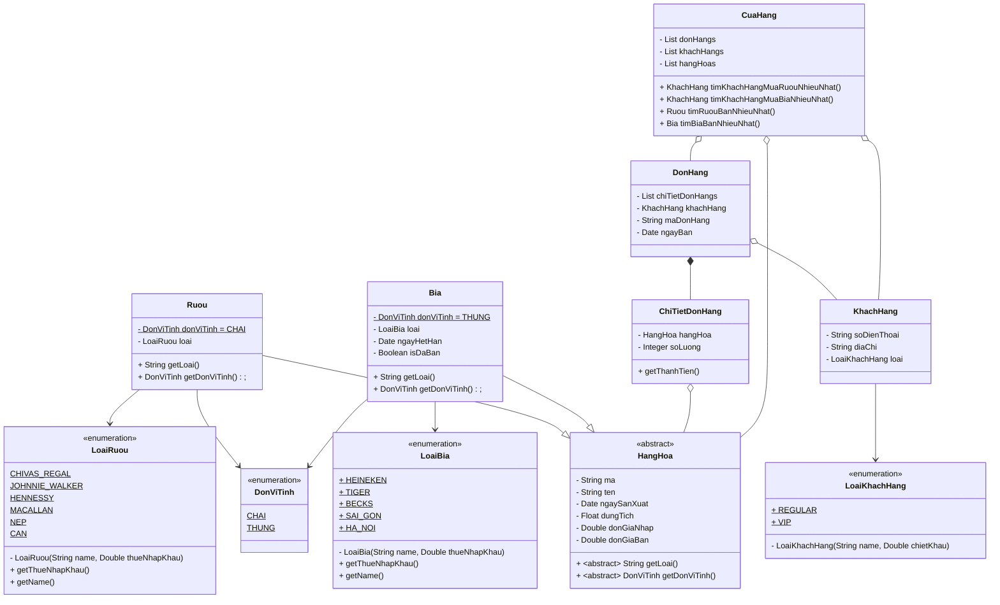

```mermaid
classDiagram
    class HangHoa {
        <<abstract>>
        - String ma
        - String ten
        - Date ngaySanXuat
        - Float dungTich
        - Double donGiaNhap
        - Double donGiaBan
        
        + &lt;abstract> String getLoai()
        + &lt;abstract> DonViTinh getDonViTinh()
    }
    
    class DonViTinh {
        <<enumeration>>
        CHAI$
        THUNG$
    }
    
    class LoaiRuou {
        <<enumeration>>
        CHIVAS_REGAL$
        JOHNNIE_WALKER$
        HENNESSY$
        MACALLAN$
        NEP$
        CAN$
        
        - LoaiRuou(String name, Double thueNhapKhau)
        + getThueNhapKhau()
        + getName()
    }
%%    note for LoaiRuou "Loại rượu có thuế nhập khẩu khác NULL là rượu ngoại"
    
    class LoaiBia {
        <<enumeration>>
        + HEINEKEN$
        + TIGER$
        + BECKS$
        + SAI_GON$
        + HA_NOI$
        
        - LoaiBia(String name, Double thueNhapKhau)
        + getThueNhapKhau()
        + getName()
    }
%%    note for LoaiBia "Loại bia có thuế nhập khẩu khác NULL là bia ngoại"    
    
    class Ruou {
        - DonViTinh donViTinh = CHAI$
        - LoaiRuou loai
        + String getLoai()
        + DonViTinh getDonViTinh();
    }
    
    Ruou --|> HangHoa
    Ruou --> DonViTinh
    Ruou --> LoaiRuou
%%    note for Ruou "Rượu là một loại hàng hoá\n Rượu có đơn vị tính là CHAI\n Rượu có loại rượu là LoaiRuou"
    
    class Bia {
        - DonViTinh donViTinh = THUNG$
        - LoaiBia loai
        - Date ngayHetHan
        - Boolean isDaBan
        + String getLoai()
        + DonViTinh getDonViTinh();
    }
    Bia --|> HangHoa
    Bia --> DonViTinh
    Bia --> LoaiBia
%%    note for Bia "Bia là một loại hàng hoá\n Bia sử dụng đơn vị tính là THUNG\n Bia có loại bia là LoaiBia"
    
    class ChiTietDonHang {
        - HangHoa hangHoa
        - Integer soLuong
        
        + getThanhTien()
    }
    
    ChiTietDonHang o-- HangHoa
%%    note for ChiTietDonHang "Chi tiết đơn hàng tham chiếu thông tin về hàng hóa"

    class LoaiKhachHang {
        <<enumeration>>
        + REGULAR$
        + VIP$
        
        - LoaiKhachHang(String name, Double chietKhau)
    }
    
    class KhachHang {
        - String soDienThoai
        - String diaChi
        - LoaiKhachHang loai
    }
    KhachHang --> LoaiKhachHang
    
    class DonHang {
        - List<ChiTietDonHang> chiTietDonHangs
        - KhachHang khachHang
        - String maDonHang
        - Date ngayBan
    }
    DonHang *-- ChiTietDonHang
    DonHang o-- KhachHang
    
%%    note for DonHang "Đơn hàng tham chiếu thông tin về khách hàng \n Đơn hàng chứa các chi tiết đơn hàng"

    class CuaHang {
        - List<DonHang> donHangs
        - List<KhachHang> khachHangs
        - List<HangHoa> hangHoas
        
        + KhachHang timKhachHangMuaRuouNhieuNhat()
        + KhachHang timKhachHangMuaBiaNhieuNhat()
        + Ruou timRuouBanNhieuNhat()
        + Bia timBiaBanNhieuNhat()
    }
    
    CuaHang o-- DonHang
    CuaHang o-- KhachHang
    CuaHang o-- HangHoa
```