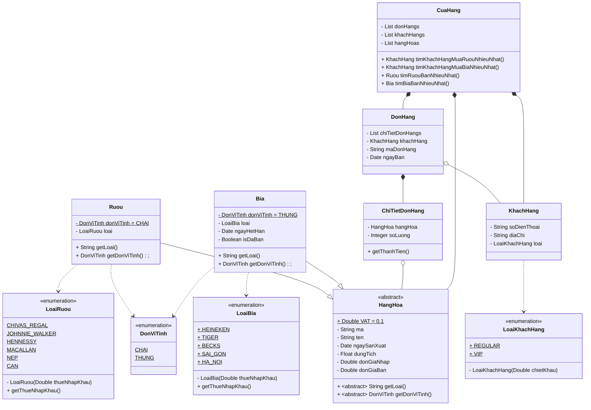

---
header-includes:
  - \usepackage{xcolor}
  - \usepackage{pagecolor}
  - \pagecolor{black}
  - \color{white}
---

## Thông tin sinh viên
- **Họ và tên:** Huỳnh Bảo Long
- **MSSV:** 23730184


## A. Sơ đồ class thể hiện sự phân cấp kế thừa



- `DonViTinh`: Enum, định nghĩa các đơn vị tính của mặt hàng
- `LoaiRuou`: Enum, định nghĩa các loại rượu
- `LoaiBia`: Enum, định nghĩa các loại bia
- `HangHoa`: Lớp cơ sở, chứa thông tin chung của một mặt hàng
- `Ruou`: Lớp mô tả một mặt hàng là rượu
- `Bia`: Lớp mô tả một mặt hàng là bia
- `ChiTietDonHang`: Lớp mô tả một chi tiết đơn hàng
- `LoaiKhachHang`: Enum, định nghĩa các loại khách hàng
- `KhachHang`: Lớp mô tả một khách hàng
- `DonHang`: Lớp mô tả một đơn hàng
- `CuaHang`: Lớp mô tả một cửa hàng

## B. Xây dựng class theo sơ đồ trên

```java
public enum DonViTinh {
    CHAI, THUNG
}

public enum LoaiRuou {
    CHIVAS_REGAL(0.1), JOHNNIE_WALKER(0.1), HENNESSY(0.1), MACALLAN(0.1), NEP(NULL), CAN(NULL);

    private final Double thueNhapKhau;

    LoaiRuou(Double thueNhapKhau) {
        this.thueNhapKhau = thueNhapKhau;
    }

    public Double getThueNhapKhau() {
        return thueNhapKhau;
    }
}

public enum LoaiKhachHang {
    REGULAR(0.0), VIP(0.05);

    private final Double chietKhau;

    LoaiKhachHang(Double chietKhau) {
        this.chietKhau = chietKhau;
    }
}


public enum LoaiBia {
    HEINEKEN(0.1), TIGER(0.1), BECKS(0.1), SAI_GON(NULL), HA_NOI(NULL);

    private final Double thueNhapKhau;

    LoaiBia(Double thueNhapKhau) {
        this.thueNhapKhau = thueNhapKhau;
    }

    public Double getThueNhapKhau() {
        return thueNhapKhau;
    }
}

public abstract class HangHoa {
    public static final Double VAT = 0.1;

    private String ma;
    private String ten;
    private Date ngaySanXuat;
    private Float dungTich;
    private Double donGiaNhap;
    private Double donGiaBan;

    public abstract String getLoai();

    public abstract DonViTinh getDonViTinh();
}

public class Ruou extends HangHoa {
    private DonViTinh donViTinh = DonViTinh.CHAI;
    private LoaiRuou loai;

    @Override
    public String getLoai() {
        return loai.name();
    }

    @Override
    public DonViTinh getDonViTinh() {
        return donViTinh;
    }
}

public class Bia extends HangHoa {
    private DonViTinh donViTinh = DonViTinh.THUNG;
    private LoaiBia loai;
    private Date ngayHetHan;
    private Boolean isDaBan;

    @Override
    public String getLoai() {
        return loai.name();
    }

    @Override
    public DonViTinh getDonViTinh() {
        return donViTinh;
    }
}

public class ChiTietDonHang {
    private HangHoa hangHoa;
    private Integer soLuong;

    public Double getThanhTien() {
        // Implement
    }
}

public class KhachHang {
    private String soDienThoai;
    private String diaChi;
    private LoaiKhachHang loai;
}

public class DonHang {
    private List<ChiTietDonHang> chiTietDonHangs;
    private KhachHang khachHang;
    private String maDonHang;
    private Date ngayBan;
}

public class CuaHang {
    private List<DonHang> donHangs;
    private List<KhachHang> khachHangs;
    private List<HangHoa> hangHoas;

    public KhachHang timKhachHangMuaRuouNhieuNhat() {
        // Implement
    }

    public KhachHang timKhachHangMuaBiaNhieuNhat() {
        // Implement
    }

    public Ruou timRuouBanNhieuNhat() {
        // Implement
    }

    public Bia timBiaBanNhieuNhat() {
        // Implement
    }
}
```

## C. Viết hàm tính thành tiền cho đơn hàng bao gồm 10% thuế GTGT và thuế nhập khẩu

```java
import java.util.Optional;

public class ChiTietDonHang {
    public Double getThanhTien() {
        Double thueNhapKhau;
        if (hangHoa instanceof Ruou) {
            thueNhapKhau = Optional.ofNullable(((Ruou) hangHoa).loai.getThueNhapKhau()).orElse(0.0);
        } else if (hangHoa instanceof Bia) {
            thueNhapKhau = Optional.ofNullable(((Bia) hangHoa).loai.getThueNhapKhau()).orElse(0.0);
        } else {
            throw new Exception("Loại hàng hóa không xác định");
        }

        Double thanhTien = hangHoa.donGiaBan * soLuong;
        Double vat = hangHoa.donGiaBan * HangHoa.VAT * soLuong;
        Double tienThueNhapKhau = thanhTien * thueNhapKhau * soLuong;
        return thanhTien + vat + tienThueNhapKhau;
    }
}

public class DonHang {
    /*
     * Tính tổng tiền của đơn hàng bao gồm cả thuế GTGT và thuế nhập khẩu
     * @return tổng tiền của đơn hàng
     */
    public Double getTongTien() {
        return chiTietDonHangs.stream().mapToDouble(ChiTietDonHang::getThanhTien).sum();
    }
}
```

## D. Viết hàm tìm khách hàng mua rượu nhiều nhất

```java
public class CuaHang {
    public KhachHang timKhachHangMuaRuouNhieuNhat() {
        return donHangs.stream()
                .flatMap(donHang -> donHang.getChiTietDonHangs().stream()
                        .filter(chiTietDonHang -> chiTietDonHang.getHangHoa() instanceof Ruou)
                        .map(chiTietDonHang -> Pair.of(donHang.getKhachHang(), chiTietDonHang.getSoLuong())))
                .collect(Collectors.groupingBy(Pair::getLeft, Collectors.summingInt(Pair::getRight)))
                .entrySet().stream()
                .max(Map.Entry.comparingByValue()).map(Map.Entry::getKey).orElse(null);
    }
}
```

## E. Viết hàm tìm khách hàng mua bia nhiều nhất

```java
public class CuaHang {
    public KhachHang timKhachHangMuaBiaNhieuNhat() {
        return donHangs.stream()
                .flatMap(donHang -> donHang.getChiTietDonHangs().stream()
                        .filter(chiTietDonHang -> chiTietDonHang.getHangHoa() instanceof Bia)
                        .map(chiTietDonHang -> Pair.of(donHang.getKhachHang(), chiTietDonHang.getSoLuong())))
                .collect(Collectors.groupingBy(Pair::getLeft, Collectors.summingInt(Pair::getRight)))
                .entrySet().stream()
                .max(Map.Entry.comparingByValue()).map(Map.Entry::getKey).orElse(null);
    }
}
```

## F. Viết hàm tìm rượu bán nhiều nhất

```java
public class CuaHang {
    public Ruou timRuouBanNhieuNhat() {
        return donHangs.stream()
                .flatMap(donHang -> donHang.getChiTietDonHangs().stream()
                        .filter(chiTietDonHang -> chiTietDonHang.getHangHoa() instanceof Ruou)
                        .map(ChiTietDonHang::getHangHoa))
                .collect(Collectors.groupingBy(Function.identity(), Collectors.summingInt(ChiTietDonHang::getSoLuong)))
                .entrySet().stream()
                .max(Map.Entry.comparingByValue()).map(Map.Entry::getKey).orElse(null);
    }
}
```

## G. Viết hàm tìm bia bán nhiều nhất

```java
public class CuaHang {
    public Bia timBiaBanNhieuNhat() {
        return donHangs.stream()
                .flatMap(donHang -> donHang.getChiTietDonHangs().stream()
                        .filter(chiTietDonHang -> chiTietDonHang.getHangHoa() instanceof Bia)
                        .map(ChiTietDonHang::getHangHoa))
                .collect(Collectors.groupingBy(Function.identity(), Collectors.summingInt(ChiTietDonHang::getSoLuong)))
                .entrySet().stream()
                .max(Map.Entry.comparingByValue()).map(Map.Entry::getKey).orElse(null);
    }
}
```